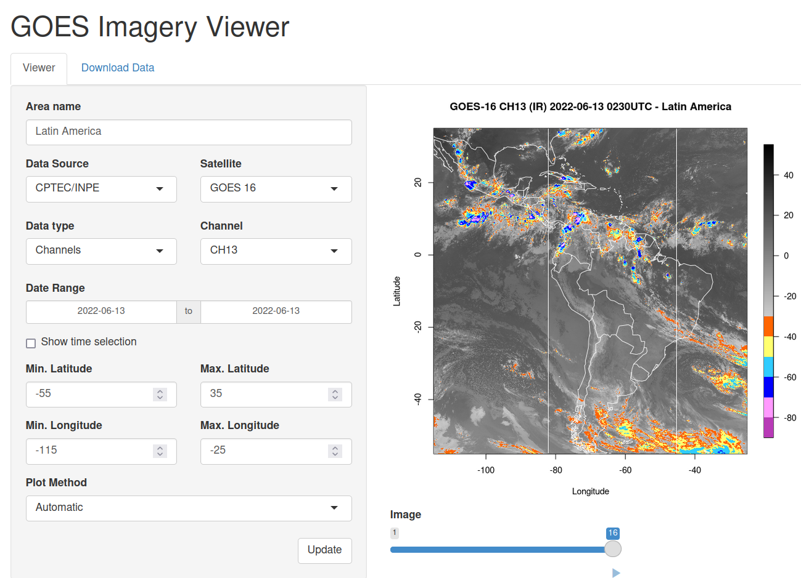

# GOES-imagery-viewer


An interactive imagery viewer web app for the GOES satellites, widely used in meteorology for the Americas. Written in R language.


## Uses
For now, in this app you can download GOES-16 data from the [CPTEC/INPE FTP](http://ftp.cptec.inpe.br/). This data can be viewed and animated in any selected area of Latin America (you can set latitude/longitude limits) and for any of the sixteen GOES-16 channels. You can select a date range and which hours and minutes you want to see. The images are downloaded "on the fly" as you request each image to show up but you can also download it before using the `Viewer`, in the `Download Data` tab. Also, if you want to use this data elsewhere, you can just use this secondary tab. The animation might take a while to run the first time, but as it is cached it will be faster in the following ones. And finally, each plot you make can be saved right-clicking it and clicking in "Save Image As...".



(color palette from older CPTEC/INPE images)

## Requirements
To use this app you need to have [R](https://www.r-project.org/) and [RStudio](https://www.rstudio.com/) (both are free) in your computer (you can also try to copy and paste the scripts in Google Colab or similar but it wasn't tested yet) as well as the packages listed bellow. A comprehensive guide to install R and RStudio can be seen [here](https://rstudio-education.github.io/hopr/starting.html), for Windows, Mac and Linux. 

## How to download
You can find all app versions in the [Tags](https://github.com/rodrigolustosa/GOES-imagery-viewer/tags) tab, where you can download them zipped. You can also right-click in the `Code` green tab and download it from there, or also clone the repository in your computer (if you are familiar with Git).

## Packages
Some R packages were used to build this app (the most important one being Shiny, responsible for the entire page layout). You can download them executing the following code in your R console:
```
install.packages("shiny")
install.packages("tidyverse")
install.packages("lubridate")
install.packages("RCurl")
install.packages("ncdf4")
install.packages("raster")
install.packages("fields")
install.packages("maps")
```
**If you are using Linux**, it is necessary to install some dependencies before trying to install packages ([this page](https://blog.zenggyu.com/en/post/2018-01-29/installing-r-r-packages-e-g-tidyverse-and-rstudio-on-ubuntu-linux/) shows everything you need to know about installing R, RStudio and packages). If you already have installed R (r-base), run the following code in your terminal:
```
sudo apt install r-base-dev
sudo apt install libcurl4-openssl-dev libssl-dev libxml2-dev
sudo add-apt-repository ppa:marutter/rrutter3.5
sudo apt install libudunits2-dev libgdal-dev libgeos-dev libproj-dev libfontconfig1-dev
```
This will be enough to install packages using `install.packages` as shown before.

## How to start
After installing R, RStudio and all packages and downloading (and unzipping) the app, you should open `app.R` file in RStudio (Make sure all files and folders that follow `app.R` are in the same directory as `app.R`). A green arrow followed by `Run App` button will be located on the right upper corner of the first panel. You can just click on it or also select the entire text script (`Ctrl+A`) and press `Ctrl+Enter`. 


## Sugestions and contributions

Is there any tool or feature you would like to see in this app? (even if it's already on the list bellow). Found a bug? Fell free to make suggestions and contributions, in English ou em português, in the [Issues](https://github.com/rodrigolustosa/GOES-imagery-viewer/issues) tab (or make a [Pull Request](https://github.com/rodrigolustosa/GOES-imagery-viewer/pulls)). You can also email me at <rodrigo.lustosa.repositorios@gmail.com>.


## Features 
#### Viewer options:
- [x] View data
- [x] Select time and date range
- [X] Text input for area title
- [X] images animation
- [ ] Adjust map limits by:
  - [X] Typing its limits
  - [ ] Slide-bar
  - [ ] Draw a box in the map with your mouse
- [ ] Different projections
  - [X] Latitude/Longitude
  - [ ] Geostationary
- [ ] add plot units
- [ ] improve plot scale
- [ ] Change plot dimensions
- [ ] Change images title
- [ ] secondary tab inside `Viewer`: Scatter diagrams for supervised cloud classification
- [ ] change animation velocity
- [ ] color palette selection
- [ ] View images in an interactive map (like Open Street Map)

#### Tools:
- [X] secondary tab for download only
- [ ] Options to save plots
  - [X] Right-click
  - [ ] 'Save' and 'Save all' buttons
  - [ ] 'Save as...' and 'Save all as...' buttons
    - [ ] Change files names and resolution
- [ ] Get coordinates and values by clicking on the map
- [ ] cancel download button
- [ ] Interactive option to draw boxes 
- [ ] time interval of older GOES-16 data was 15 minutes, not 10 minutes. Cover these images as well

#### Different data sources:
- [x] Download data that will be used
- [ ] Download from the following sources
  - [X] [CPTEC/INPE FTP](http://ftp.cptec.inpe.br/)
  - [ ] [Amazon Server](https://noaa-goes16.s3.amazonaws.com/index.html)
- [ ] Different satellites
  - [X] GOES-16
  - [ ] GOES-17
  - [ ] past GOES series
- [ ] Different data products
  - [X] Channels in reflectance and brightness temperature
  - [ ] RGB compositions
  - [ ] Rain Rate QPE (RRQPE)
  - [ ] Hidroestimator
  - [ ] INPE Cloud Classification
  - [ ] GLM data
  
#### Others:
- [X] progress bar for download
- [ ] add educational texts

## License
All code written in this repository is distributed under the MIT License. For more information read the License file.


